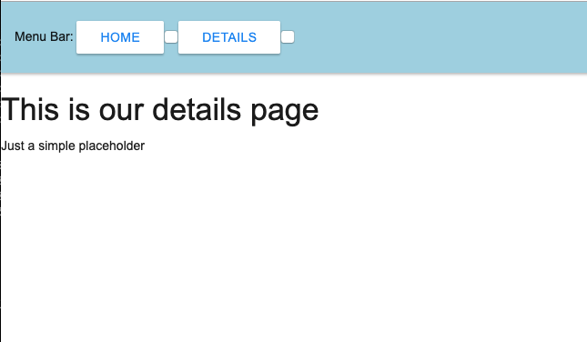
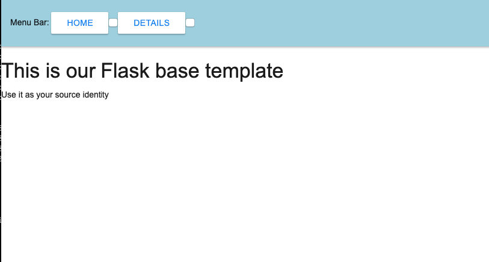

# Flask template

This project contains a set of tools and howto's to start working with [_flask_](http://flask.palletsprojects.com/en/1.1.x/) micro-web framework.

> Tools
> - `python 3.8`
> - `flask`
> - `pytest`

## Run application
Run script from the root directory of the project and open `http://localhost:4000` url in your WEB browser:
```bash
~ flask run
```

## Demo
**Home page**



**Details page**



Please modify `.flaskenv` file to set your own application environment variables.

## Contributing

- clone the repository
- configure Git for the first time after cloning with your name and email
  ```bash
  git config --local user.name "Volodymyr Yahello"
  git config --local user.email "vyahello@gmail.com"
  ```
- `pip install -r requirements.txt` to install code dependencies
