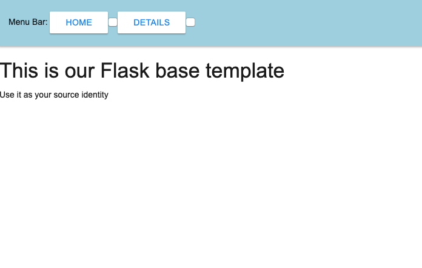

[](https://www.python.org/)
[](https://github.com/psf/black)
[](LICENSE.md)

# Flask template

This project contains set of instructions to start working with **flask** micro-web framework (for reference mostly).

**Tools**
- [python 3.8](https://www.python.org/downloads/release/python-380)
- [flask](http://flask.palletsprojects.com)
- [pytest](https://www.pylint.org)

## Usage
Run script from the root directory of the project and open [http://localhost:4000](http://localhost:4000) url in your WEB browser:
```bash
~ flask run
```

Please modify [.flaskenv](.flaskenv) file to set your own application environment variables.

## Demo
> Note: it's just a quick sample, please don't write front-end like this :)


### Meta

Author – Volodymyr Yahello

Distributed under the `MIT` license. See [LICENSE](LICENSE.md) for more information.

You can reach out me at:
* [vyahello@gmail.com](vyahello@gmail.com)
* [https://github.com/vyahello](https://github.com/vyahello)
* [https://www.linkedin.com/in/volodymyr-yahello-821746127](https://www.linkedin.com/in/volodymyr-yahello-821746127)

### Contributing
1. clone the repository
2. configure Git for the first time after cloning with your `name` and `email`
3. `pip install -r requirements.txt` to install all project dependencies